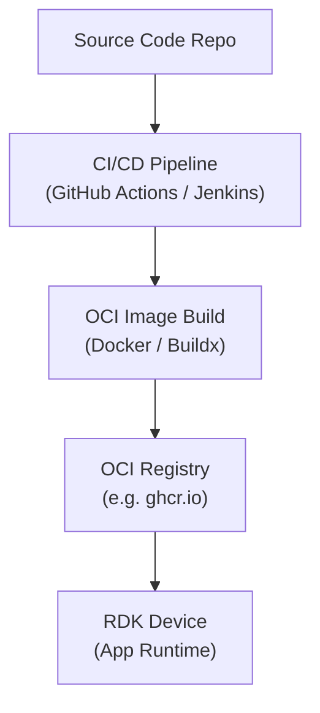

# App Architecture & Build Flow

## Summary

This guide defines:

- How to [**build OCI images &rarr;**](002_dockerfile.md)
- How to [**package RDK-B apps &rarr;**](003_oci_image.md)
- How to [**deploy via CI/CD &rarr;**](003_oci_image.md)
- How to [**optimize for production &rarr;**](004_advanced.md)

## Overview

RDK Broadband (RDK-B) applications designed for **prplLCM** and **Dobby** are packaged as **OCI (Open Container Initiative) images**.

An OCI image is a standardized container format that includes:

- Application binaries
- Runtime dependencies
- Metadata (labels, versioning)
- Execution instructions (entrypoint / CMD)

These images are:

- **Built once** (cross-platform if needed)
- Stored in a **container registry** (e.g., GitHub Container Registry (GHCR))
- **Pulled** and executed by container runtimes like prplLCM or DAC

## High-Level Architecture



## Expected Vendor Workflow

### 1. Build Trigger

- Triggered on **Git tag (e.g., v1.2.3)**
- Ensures semantic versioning

```yaml
on:
  push:
    tags:
      - 'v[0-9]+.[0-9]+.[0-9]+'
```

### 2. Version Extraction

```bash
APP_VERSION=$(git describe --tags --exact-match HEAD | sed 's/^v//')
```

Used for:

- Image tagging
- OCI metadata labels

### 3. Multi-Architecture Build

Typical targets:

- `arm64` (aarch64)
- `armv7`
- `amd64`

### 4. Image Tagging Strategy

Each build produces:
```
ghcr.io/org/app:arm64
ghcr.io/org/app:arm64-1.2.3
ghcr.io/org/app:latest
ghcr.io/org/app:1.2.3
```

### 5. Multi-Platform Manifest
A final manifest combines all architectures:

```bash
docker manifest create ghcr.io/org/app:1.2.3 ghcr.io/org/app:arm64-1.2.3 ghcr.io/org/app:armv7-1.2.3 ghcr.io/org/app:amd64-1.2.3
docker manifest push ghcr.io/org/app:1.2.3
```

This allows you to automatically pull the correct architecture:

```bash
docker pull ghcr.io/org/app:1.2.3
```

## Key Takeaways

- **OCI images** are the standard deployment artifact
- CI/CD pipelines handle build, test, and distribution
- Multi-arch support is strongly recommended
- Images must be **lightweight** and **secure**