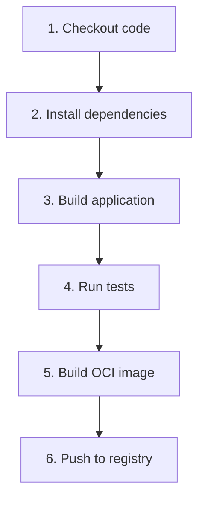

# Compiling & Hosting The OCI Image

## Overview

This section explains how to:

- Cross-compile applications (using `musl` for static `libc` bindings)
- Build OCI images
- Publish to container registries

## Cross Compilation

### Example Targets

| Architecture | Target Triple (using `musl`) |
|---|---|
| ARM64 | aarch64-unknown-linux-musl |
| ARMv7 | armv7-unknown-linux-musleabihf |
| AMD64 | x86_64-unknown-linux-musl |

### Installing Toolchains
```bash
sudo apt-get install gcc-aarch64-linux-gnu
sudo apt-get install gcc-arm-linux-gnueabihf
sudo apt-get install musl-tools
```

### Rust Build Example

```bash
cargo build --release --target aarch64-unknown-linux-musl
```

## CI/CD Workflow (GitHub Actions)

### Key Stages



### Build & Push Example

```bash
docker buildx build \
  --platform linux/arm64 \
  --push \
  --tag ghcr.io/org/app:arm64 \
  .
```

### Using Buildx for Multi-Arch

```yaml
- uses: docker/setup-qemu-action@v3
- uses: docker/setup-buildx-action@v3
```

## Registry: GitHub Container Registry (GHCR)

### Login

```bash
docker login ghcr.io
```

### Push Image

```bash
docker push ghcr.io/org/app:arm64
```

### Tagging Strategy

| Tag | Purpose |
|---|---|
| `latest` | Most recent stable |
| `1.2.3` | Release version |
| `arm64` | Architecture |
| `arm64-1.2.3` | Arch + version |

## Automation Options

| Option | Pros |
|---|---|
| **GitHub Actions (Recommended)** | - Native integration<br>- Easy secrets management |
| Jenkins | - More customizable pipelines |
| Python Scripts | - Lightweight automation<br>- Useful for local builds |

## Image Labels in CI

```bash
--label "org.opencontainers.image.version=${APP_VERSION}"
--label "org.opencontainers.image.revision=${SHORT_SHA}"
```

## Key Takeaways
- Cross-compilation is essential for RDK targets
- Automate everything via CI/CD
- Use semantic version tags
- Always push versioned + latest images